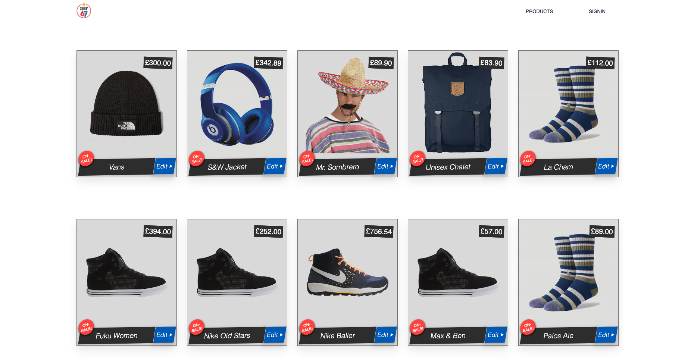

# NxShop67 :convenience_store: | 

:lollipop: A React/NextJS application [Revamp mo.&nbsp; :pizza: ..:snail:]

 

## :paperclip: Install

:lollipop: Type `npm install`  
:lollipop: Type `npm run dev` // opens in port 3003.  
:lollipop: Node v16.17.0

## :paperclip: Front-end

:lollipop: ReactJS, NextJS, Apollo Client, Styled components

#### <kdb>Frontend</kdb>

 
 

#### Back-end :paperclip: separate
- updated all dependencies.

 

<kbd>**Sl**</kbd>
