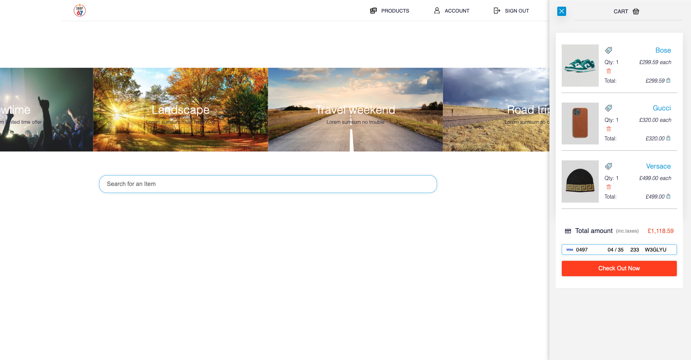
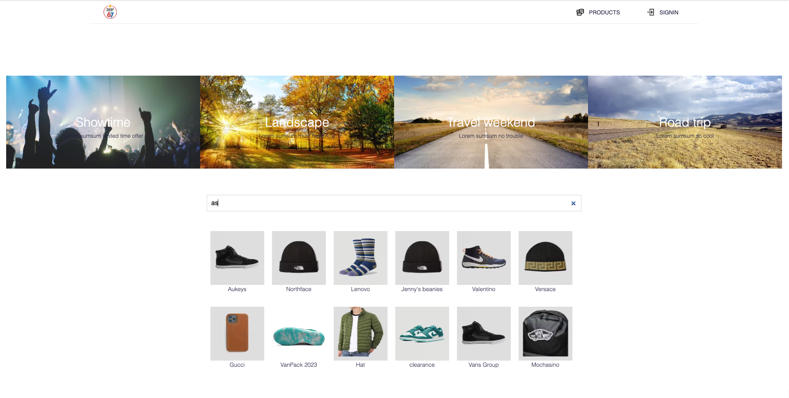
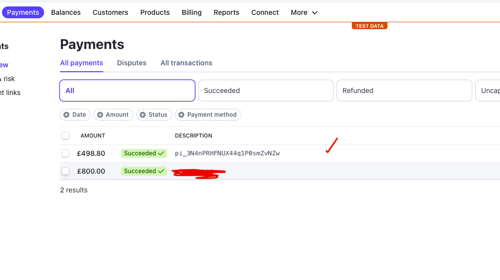
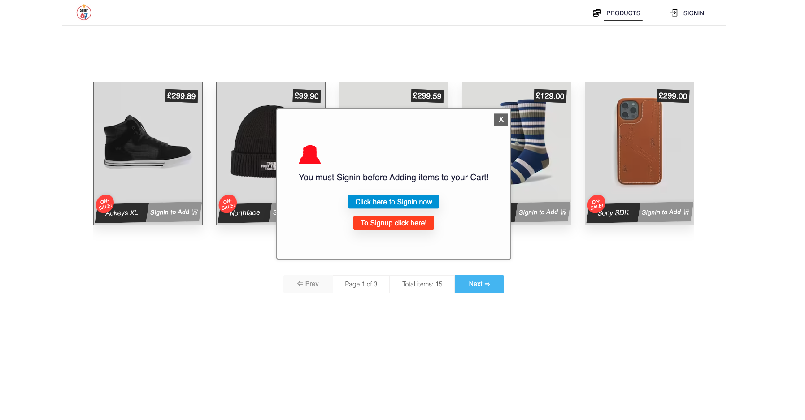

# NxShop67 :convenience_store: | 

:lollipop: A React/NextJS application [Revamp mo.&nbsp; :pizza: ..:snail:]

 

## :paperclip: Install

:lollipop: Type `npm install`  
:lollipop: Type `npm run dev` // opens in port 3003.  
:lollipop: Node v16.17.0

## :paperclip: Front-end

:lollipop: ReactJS, NextJS, Apollo Client, Styled components

#### <kdb>Frontend</kdb>

 

 

#### Back-end :paperclip: separate
- updated all dependencies.

 

#### Login Modal

##### About Modal

1. User not signin, it will appear everytime in products page
  
  - Close it and continue browsing
  - Follow signin/signup link to be redirected and welcome with confetti

2. User signed in, it won't show up at all.

3. A bit of overkill feature since i have already disabled link that lets a user 'add to cart'
  when the user isn't signin, but atm the welcoming confetti that appears on the signin and signup pages after
  you have clicked on the link is too good to let go of.

4. Should find out best way to implement this feature later:

  - Once per session
  - Remove entirely since links are now disabled or 
  - Leave original 'add to cart' links and only show modal when user clicks link 
    and not signed in.

<kbd>**Sl**</kbd>
