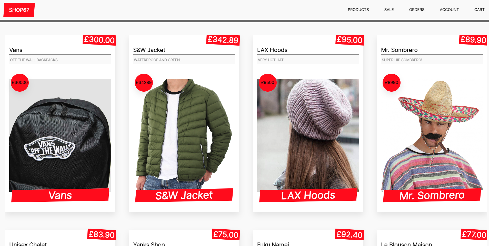

# NxShop67  :convenience_store:

:lollipop: A React/NextJS application [0N-GING&nbsp; ..:snail:]

## :paperclip: Install 

:lollipop: Type `cd frontend && npm install` from root.                                          
:lollipop: Type `npm run dev` to open in port 3003.               

## :paperclip: Front-end

:lollipop: ReactJS, NextJS, Apollo Client, Styled components

## :paperclip: Back-end

:lollipop: Keystone CMS, Mongo Atlas and GQL
 

:lollipop: __<a href="https://keystonejs.com" target="_blank">See KeystoneJS docs/guides</a>__

  Generally follows these steps:
  1. Create a DB           
  2. Create a KeystoneJS account.  
  3. Create app: `npx create-keystone-app`
  4. Link DB <-> CMS account passing DB env vars.  
  5. It will then create an AdminUI, and generate a GQL API based on 
      the schema/data passed.        

 

<kdb>KeystoneJS</kdb>

 

<kdb>Frontend</kdb>

 

<figure>
 <video width='834' height='422' controls poster='public/static/keystone.png'>
<source src='https://res.cloudinary.com/dak4fznwo/video/upload/ac_none,b_rgb:f0f2e2,c_scale,e_fade:1000,w_702/v1663138172/nxshop67_PRODUCTS_ffbve6.mov' type='video/mov'>
</video>
</figure>

<kbd>__Sl__</kbd>
