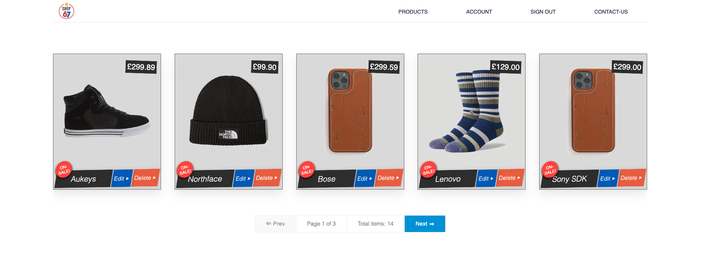

# NxShop67 :convenience_store: | [](https://deepscan.io/dashboard#view=project&tid=16862&pid=22444&bid=662143)

:lollipop: A React/NextJS application [Revamp mo.&nbsp; :pizza: ..:snail:]

<br />

## &#x1FA97;  Install

<br />

### &#x2694; Frontend:
Frontend only atm
```bash
Type `npm install && npm run dev`   // opens in port 3003
```

&#x267E; ReactJS, NextJS, Apollo Client, Styled components

<br />

### &#x2694; Backend:
Trying out Payload Headless CMS
```bash
Type `npm install && npm run dev` // opens in port 3000.  
```

&#x267E; NextJS, GraphQL, MongoDB

<kbd>&#x2B86; Node v16 </kbd>

##


:lollipop: &#x2116; 3




<br />
<br />


### &#x1FA97;  About ongoing project changes

<br />

#### &#x2694; Rendering
- Server-side, Client-side rendering, Static generation  with Next

#### &#x2694; ***State***
- `Local state` √  at component level when appropriate.  
- `Global state`≈ No global state. Context API state across multiple components          
- `Server and form state` √ -  Graphql/Apollo data,  including loading/error states.          

####  &#x2694; *Auth flow*  
- Basic authentication token w/ email/passowrd using Keystone Client

#### &#x2694; **Styling**     
- Global CSS variables/reset stylesheet    
- Styled components    (CSS in JS)

#### &#x2694; **Testing**

-  Unit testing w/ Jest    
-  Integration testing w/ end-to-end Cypress    

<br />

<kbd>**Sl**</kbd>
