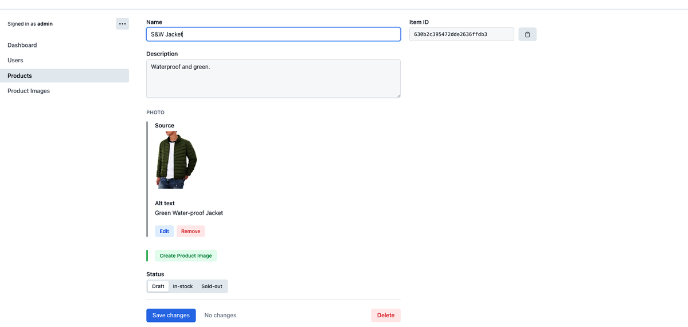
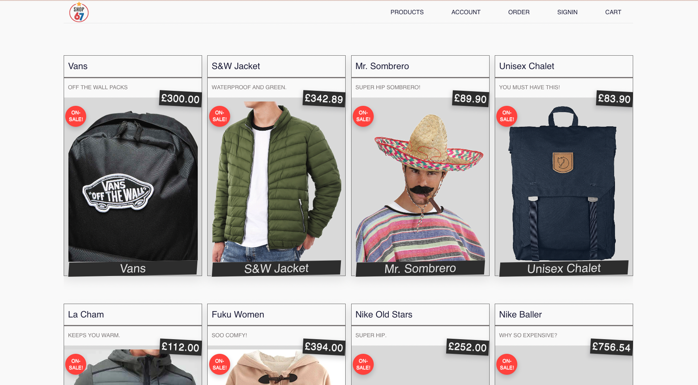

# NxShop67 :convenience_store: | 

:lollipop: A React/NextJS application [0N-GING&nbsp; ..:snail:]

## :paperclip: Install

:lollipop: Type `npm install`  
:lollipop: Type `npm run dev` // opens in port 3003.  
:lollipop: Node v16.17.0

## :paperclip: Front-end

-p 3003

:lollipop: ReactJS, NextJS, Apollo Client, Styled components

:paperclip: headless cms backend /graphql - mongo atlas

 

#### <kdb>Frontend s2</kdb>

 

<kbd>**Sl**</kbd>
