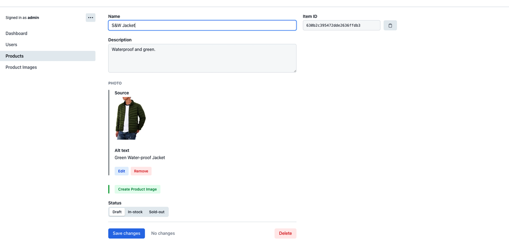

# NxShop67  :convenience_store:  | 

:lollipop: A React/NextJS application [0N-GING&nbsp; ..:snail:]

## :paperclip: Install

:lollipop: Type `npm install`  
:lollipop: Type `npm run dev` // opens in port 3003.

## :paperclip: Front-end

:lollipop: ReactJS, NextJS, Apollo Client, Styled components

## :paperclip: Back-end

:lollipop: Keystone CMS, Mongo Atlas and GQL

:lollipop: **<a href="https://keystonejs.com" target="_blank">See KeystoneJS docs/guides</a>**

Generally follows these steps:

1. Create a DB
2. Create a KeystoneJS account.
3. Create app: `npx create-keystone-app`
4. Link DB <-> CMS account passing DB env vars.
5. It will then create an AdminUI, and generate a GQL API based on
   the schema/data passed.

 

#### <kdb>KeystoneJS</kdb>

 

#### <kdb>Frontend s2</kdb>

 

<kbd>**Sl**</kbd>
